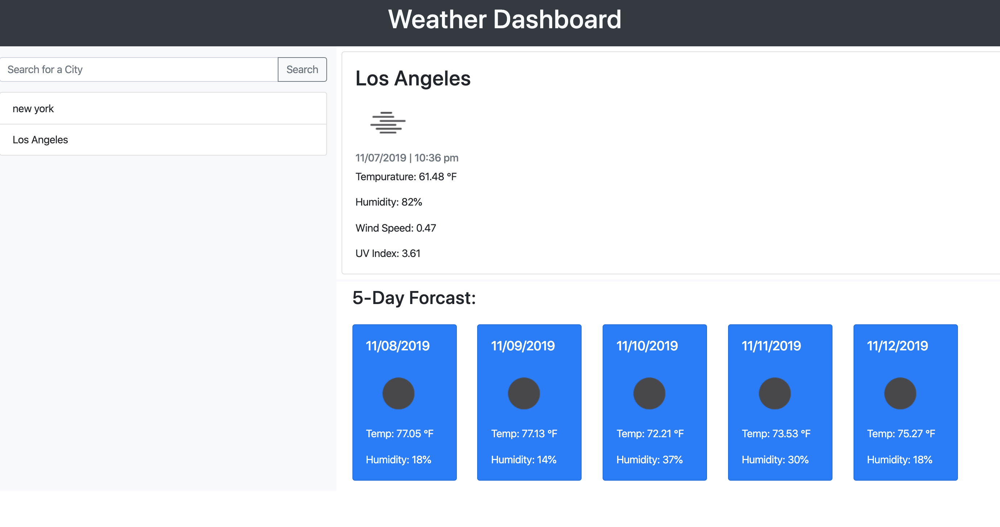

# WeatherDash

The Weather Dash will display your local location based on you geolocation. If you wish to add more locations, simply enter the location on the search field and click or press enter. You will then be displayed with a 5 day forecast of the weather with icons on how the weather is. Utilizing local storage, the weather will be cached on your browser for later viewing along with the previous history search. 

# Purpose
As a traveveler, people want to see how the weather in the current or local area will, or currently is.

## Searching a Location

# GitHub Repo: 
https://github.com/INKA10/WeatherDash

# Live Pages: 
https://inka10.github.io/WeatherDash/
